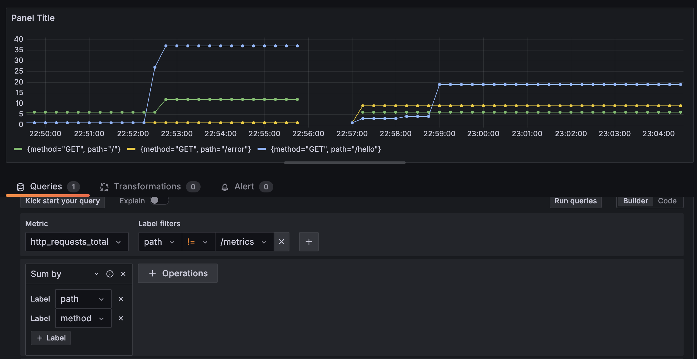
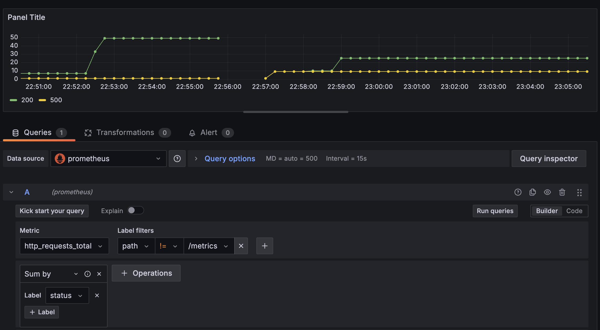

# Rust OpenTelemetry

## Run the server

```shell
RUST_LOG=info cargo run
```

## Grafana

### Dashboard




## TODO

- [ ] Add Prometheus, Metrics and logs
- [ ] Use OpenTelemetry semantic conventions
